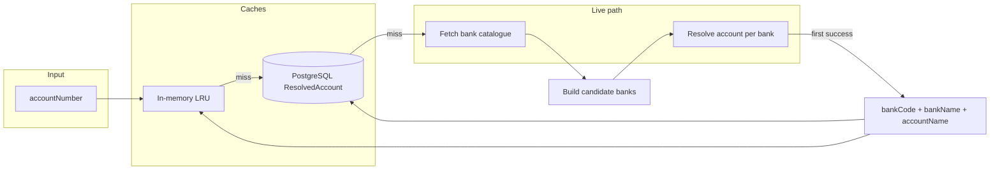

# Bankfinder

**Bankfinder** is a small [NestJS](https://nestjs.com/) service that helps you figure out **which Nigerian bank** a **10-digit NUBAN** account number belongs to, and returns the **account holder name** in one step. It talks to an **upstream banking API** (bank catalogue + account resolve) and optionally **PostgreSQL** (via [Prisma](https://www.prisma.io/)) to remember past resolutions.

This project is intended to be **open source**: fork it, self-host it, and swap or extend integrations as you like.

---

## Why it exists

Resolving “which bank is this account?” is awkward when you only have an account number. Different integrations expose bank lists and name-enquiry APIs in different shapes. Bankfinder:

1. Pulls the **authoritative bank list** from the configured integration.
2. Maps your **priority bank labels** to that list (fuzzy name match) so **bank codes always come from the live catalogue**, not hardcoded guesswork.
3. Calls the integration’s **account resolve** API to see which bank actually recognises the account.
4. Returns **`bankCode`**, **`bankName`**, and **`accountName`** together.

It also applies **NUBAN prefix** rules where a 3-digit prefix clearly identifies a commercial bank, so the resolver does not “race” every digital bank against a traditional bank and pick the wrong winner.

---

## How it works (high level)



1. **Fetch the bank catalogue** (cached ~1 hour). Priority names in code are matched to catalogue rows; every other bank returned by the integration is appended so nothing is silently omitted.
2. **Resolve**  
   - If the account’s **first 3 digits** match a known **NUBAN sort-code prefix**, only the mapped bank is queried (avoids false positives when several endpoints “accept” the same number).  
   - Otherwise, candidates are ordered with **priority banks first**, then the rest; **`Promise.any`** runs resolve calls in parallel and takes the **first successful** response (with a per-call timeout).
3. **Caching**  
   - Short **in-memory** cache for hot account numbers.  
   - **Prisma** `ResolvedAccount` table: upsert after a live hit so restarts and repeat lookups avoid hammering the API.

---

## API

Default HTTP port: **`3001`**. OpenAPI / Swagger UI: **`/api`**.

| Method | Path | Purpose |
|--------|------|--------|
| `GET` | `/account-resolver/banks` | Cached list of banks (code + label) used for resolution. |
| `GET` | `/account-resolver/resolve?accountNumber=` | **Single call**: resolve bank + account name (or failure). |
| `POST` | `/account-resolver/lookup-account-name` | Body: `{ "bankCode", "accountNumber" }` — resolve when you already know the bank code. |

**Successful resolve** (`GET …/resolve`) returns JSON like:

```json
{
  "success": true,
  "message": "Bank and account resolved.",
  "data": {
    "bankCode": "000000",
    "bankName": "Example Bank Ltd",
    "accountName": "JANE DOE"
  }
}
```

---

## Configuration

Create a `.env` (see `.gitignore` — do not commit secrets). Set at least:

- **Database:** `DATABASE_URL` — PostgreSQL connection string for Prisma (or your hosted DB URL if you use a connection pooler).
- **HTTP integration:** base URL and bearer/API credentials as required by your deployment. Variable names and defaults are defined where the HTTP client is configured in source (search for `ConfigService` / env keys in the repo).

Run migrations when you change the schema:

```bash
npx prisma migrate deploy
```

---

## Project setup

```bash
npm install
```

`postinstall` runs **`prisma generate`** so the client is always present after install.

## Run

```bash
# development
npm run start:dev

# production build + run
npm run build
npm run start:prod
```

## Tests

```bash
npm run test
npm run test:e2e
npm run test:cov
```

---

## Tech stack

- **Runtime:** Node.js  
- **Framework:** NestJS 10  
- **HTTP client:** `@nestjs/axios`  
- **Outbound integration:** HTTPS bank catalogue + account resolve (implementation in `src/`)  
- **Persistence:** Prisma + PostgreSQL (`ResolvedAccount` model)  
- **Docs:** `@nestjs/swagger` at `/api`  

---

## Contributing & license

Contributions are welcome: issues and pull requests. Keep secrets out of git and follow the **terms of use and rate limits** of whatever banking API you connect to when testing.

This repository’s `package.json` currently declares `"license": "UNLICENSED"`. **If you are open-sourcing publicly**, pick a license (e.g. MIT) and add a `LICENSE` file so others know how they may use the code.

---

## Disclaimer

Bankfinder talks to third-party financial APIs. Accuracy depends on the integration and the account. Use for **automation / internal tools** with care; do not rely on it as the only verification for high-risk money movement without your own checks.
